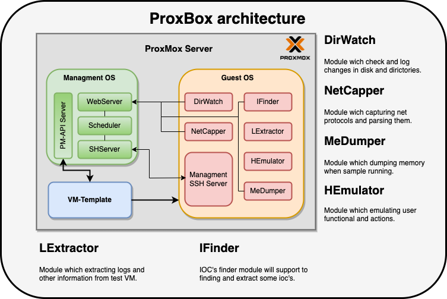

# PROXBOX
## Open-Sorce ProxMox based fully-automatic Sandbox

### Description:
This project is aimed at automated testing of malware and collection of primary information including IOC's. Basic documentation for the  [ProxMox-Hypervisor](https://pve.proxmox.com/pve-docs/).

!ATTENTION! This project is not aimed at responding to and identifying malware. The main task is to facilitate and speed up the work of the analyst through automation!

### Sandbox architecture:

<h4 align=center>Common sandbox architecture</h4>

### Networking:

### How to use:

### Requirments:

### Installation:

### Usage:

### Documentation: